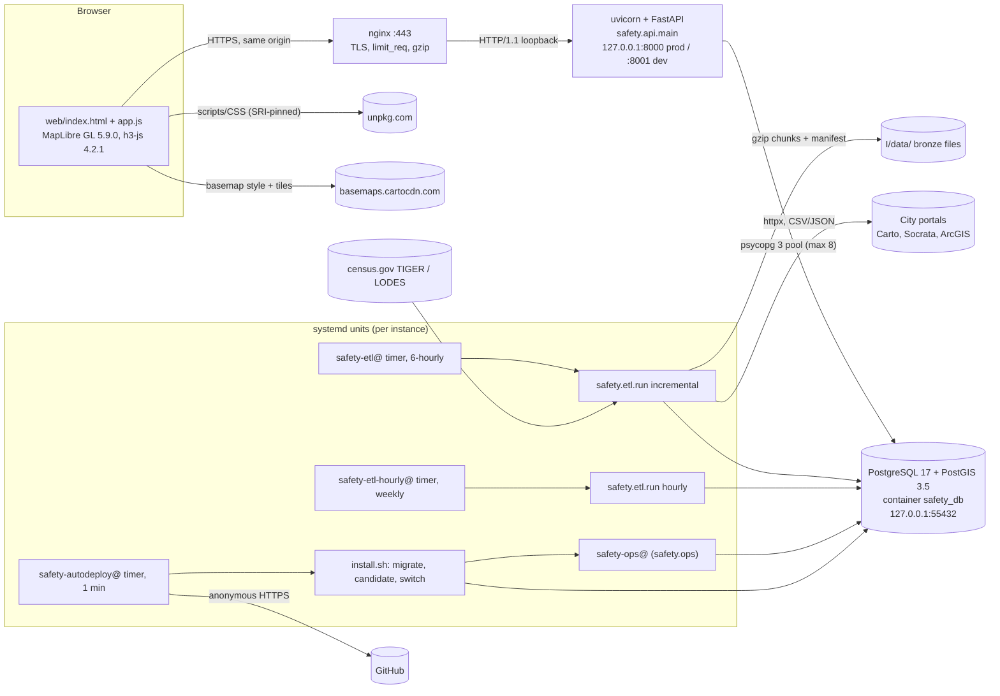
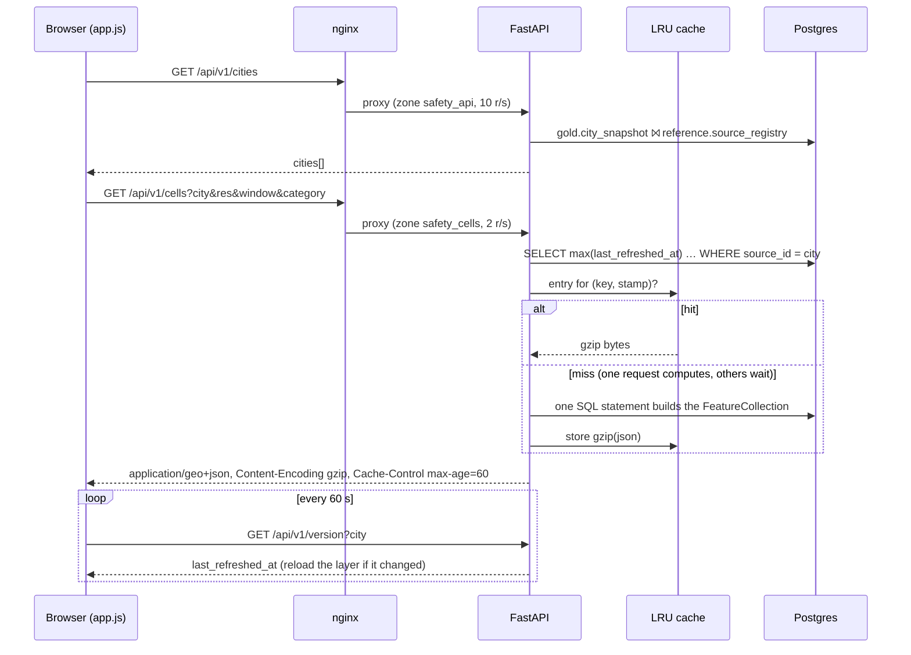
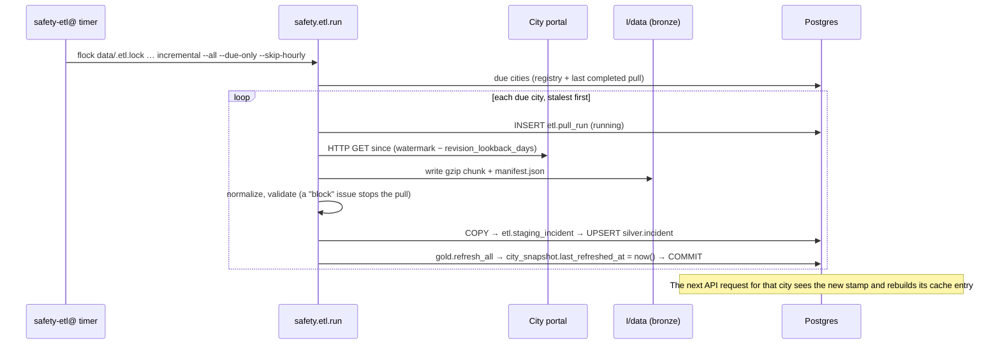
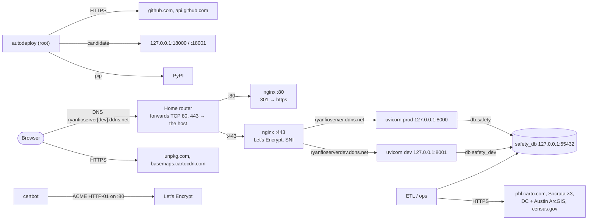

# Architecture

This document describes the system **as it is built**, as of commit `391c5ad` (2026-10-08). The target design, which
mentions Redis, S3, Airflow, vector tiles and h3-pg, is in [`DESIGN.md`](DESIGN.md). The as-built system uses none of
those (see [Design vs. as built](#design-vs-as-built)).

Contents: [Components](#components) · [Tech stack](#tech-stack) · [Request flows](#request-flows) ·
[Data model](#data-model-and-persistence) · [Networking](#networking) · [Security model](#security-model)

---

## Components



| Component | Tech | Responsibility | Port | Depends on |
|---|---|---|---|---|
| **Web frontend** | Vanilla JS, no bundler (`web/`) | Map, city picker, cell panel, "use my location" (H3 computed in the browser), refresh every 60 s | served by the API at `/` | API, unpkg, CARTO |
| **API** | FastAPI 0.141.1 on uvicorn 0.52.4 (`safety/api/`) | Read-only JSON/GeoJSON over the `gold` tables under `/api/v1`; serves `web/` as static files | 127.0.0.1:8000 (prod), :8001 (dev) | PostgreSQL |
| **ETL** | Python CLI `python -m safety.etl.run` (`safety/etl/`) | Pull from city portals → bronze files → validate → `silver.incident` → `gold.*` rollups | — | Portals, census.gov, PostgreSQL, `I/data` |
| **Adapters** | `safety/etl/adapters/` | One class per city: phl (Carto SQL, CSV), chi/sea/lax (Socrata SODA, CSV), dc and aus (Esri ArcGIS REST, JSON) | — | — |
| **Ops convergence** | `python -m safety.ops` (`safety/ops.py`) | For each *enabled* city, asks the DB what is missing (backfill / census / gold / hourly) and runs only that. Started after every deploy | — | ETL code, PostgreSQL |
| **Migrations** | `python -m safety.migrate` (`safety/migrate.py`) | Applies `db/migrations/*.sql` (checksummed, advisory-locked), then reloads crosswalk and severity CSVs | — | PostgreSQL |
| **Database** | `postgis/postgis:17-3.5` in Docker (`docker-compose.yml`) | One cluster with two databases: `safety` (prod) and `safety_dev` (dev) | 127.0.0.1:55432 → 5432 | Docker volume `crime-prevention-and-personal-safety-application_safety_db_data` |
| **Reverse proxy** | nginx 1.24 + Let's Encrypt (`deploy/nginx/`) | TLS, HTTP→HTTPS, per-IP rate limits, gzip | 80, 443 | API |
| **Deployer** | bash + systemd (`deploy/autodeploy.sh`, `deploy/lib/*.sh`) | Root timer: deploys `main`→prod and `testing`→dev once the GitHub `ci` check passes | candidates on 127.0.0.1:18000 / :18001 | GitHub, Docker DB |
| **Backups** | `deploy/lib/backup.sh` + timers | Nightly `pg_dump` of both DBs; monthly test restore | — | Docker DB |
| **Alerts** | `deploy/lib/notify.sh` via `OnFailure=` | Writes an `err` line to the journal and to `/var/lib/safety-notify/alerts.log` | — | — |

---

## Tech stack

| Layer | Technology | Version (source) | Purpose | Why it matters |
|---|---|---|---|---|
| Runtime | CPython | 3.12 (`Dockerfile:15`, `ci.yml` `python-version: "3.12"`, host `/usr/bin/python3.12` hard-coded in `deploy/lib/release.sh:21`) | Everything server-side | The deployer only works with `/usr/bin/python3.12` |
| Web framework | FastAPI | `==0.141.1` (`requirements.txt`) | HTTP routes, validation, `/docs` | |
| ASGI server | uvicorn[standard] | `==0.52.4` | One process per instance, no `--workers` | Cache and rate-limit state are per process |
| DB driver | psycopg[binary,pool] | `==3.3.5` | Sync pool for the API, plain connections for the ETL | |
| HTTP client | httpx | `==0.28.1` | Adapters and census downloads | 120 s timeout, 4 retries (`config.py:92-93`) |
| Settings | pydantic-settings | `==2.15.0` | Reads env vars and `REPO_ROOT/.env` | |
| Hex grid | h3 | `==4.5.0` | Cell index computed in Python at ingest (no h3-pg extension) | |
| Projections | pyproj | `==3.7.2` | Reprojects source coordinates | |
| Shapefiles | pyshp | `==3.1.6` | Reads TIGER/Line census blocks | |
| Tests | pytest | `==9.1.1` (`requirements-dev.txt` only) | Unit tests and DB tests | Not installed in production venvs |
| Database | PostgreSQL + PostGIS | image `postgis/postgis:17-3.5` (compose and CI) | Storage, GiST bbox index | |
| Map | MapLibre GL JS | 5.9.0, from unpkg with SRI (`web/index.html`) | Rendering | Has a critical advisory, see [Security](#known-security-concerns) |
| Browser H3 | h3-js | 4.2.1, from unpkg with SRI | "Use my location" | |
| Basemap | CARTO Positron | n/a (`web/app.js:424-450`) | Background tiles | |
| Proxy / TLS | nginx, certbot | 1.24.0, 2.9.0 (observed on host) | TLS, rate limiting | |
| Scheduler | systemd timers | Ubuntu 24.04 | ETL, deploys, backups | There is no Airflow/Prefect |
| CI | GitHub Actions | `actions/checkout@v4`, `actions/setup-python@v5`, `ubuntu-latest` | Single job `ci` | The job name is a contract with the deployer |

Indirect Python dependencies (starlette, pydantic, psycopg-pool, …) are **not pinned**. There is no lockfile.

**How the pieces interact.** Browsers talk only to nginx. nginx proxies everything, both static files and API, to one
uvicorn process on loopback. The API never computes aggregates on the request path; it reads the precomputed `gold`
tables. The ETL never talks to the API. Its only signal is `gold.city_snapshot.last_refreshed_at`, which it updates in
the same transaction as the gold rebuild. The API's cache checks that timestamp on every read, and browsers poll
`/api/v1/version` every 60 s to notice it. There is no message bus, queue or Redis.

### Design vs. as built

| `DESIGN.md` says | Code does |
|---|---|
| H3 PostgreSQL bindings (h3-pg) | H3 computed in Python, stored as text (`docker-compose.yml:3-11`) |
| Bronze in S3-compatible storage | Gzipped files on local disk under `BRONZE_ROOT` (`safety/etl/bronze.py`) |
| Airflow / Prefect / Dagster | argparse CLI + systemd timers |
| Pre-rendered vector tiles | Whole-city GeoJSON per request, gzip-cached in process |
| Redis cache | In-process LRU with the same per-city invalidation (`safety/api/main.py:141-280`) |

---

## Request flows

### Map load: `GET /api/v1/cells`



Code path: `web/app.js:577-629` → `deploy/nginx/safety.conf:114-117` → middleware (security headers, gzip, rate limit;
`safety/api/main.py:95-109`) → `cells()` validates its parameters (`main.py:470-519`) → `cached()` checks the stamp
(`main.py:243`) → on a miss, `repository.cells_geojson()` (`repository.py:427-661`). Only requests with no `bbox` and
`min_count=0` are cached.

### Point lookup: `GET /api/v1/cells/lookup?lat=&lng=`

FastAPI checks `lat ∈ [-90,90]` and `lng ∈ [-180,180]`. The H3 cell is computed in Python with no DB call
(`safety/h3grid.py`). Then `repository.cell_detail()` runs about 7–8 primary-key queries over `gold.*`; this endpoint is
uncached. A point outside coverage returns 200 with `"in_coverage": false`. The bundled frontend does **not** use this
endpoint: "use my location" computes the cell in the browser.

### ETL incremental run (one city)



The timer and unit are `deploy/systemd/safety-etl@.{timer,service}`. Orchestration is `safety/etl/run.py:826-852`,
ingestion `run.py:360-558`, and the gold rebuild `safety/etl/gold.py:1698-1779`.

---

## Data model and persistence

### Layers

| Layer | Where | What |
|---|---|---|
| **Bronze** | Files: `I/data/bronze/source_id=<id>/dataset=<ds>/pull_date=<YYYY-MM-DD>/pull_<NNNNNN>/{manifest.json,*.gz}` | Raw responses, gzipped byte-for-byte. Used for audit and `reprocess`. **Never pruned, never backed up.** |
| **Silver** | `silver.incident`, partitioned LIST(`source_id`) then RANGE(`occurred_year`); partitions created on demand | One normalized row per incident, with H3 r8/r9/r10, offense class mapped through the crosswalk, and local hour |
| **Gold** | `gold.*`: `cell_geometry`, `cell_activity`, `cell_safety`, `cell_hour_safety`, `cell_hour_profile`, `cell_monthly`, `cell_offense_mix`, `cell_exposure`, `cell_neighbor`, `city_snapshot`, `city_window` | Per-city, per-cell rollups, and the windows each city is built for. **The only tables the map reads.** Rebuilt delete-then-insert; these are ordinary tables, not materialized views |
| Reference | `reference.*`: `source_registry`, `offense_crosswalk`, `city_boundary`, `severity_scheme`, `offense_severity_weight`, `census_block`, `source_series_caveat` | Per-city config, the `enabled` and `history_*` settings, recording-change caveats, crosswalks loaded from `reference/crosswalk/*.csv` on every migrate |
| Bookkeeping | `etl.*`: `pull_run`, `validation_issue`, `staging_incident` (UNLOGGED), `ops_run`, `withdrawn_incident` | Pull history, data-quality issues, the ops retry ledger, and a 90-day archive of rows withdrawn upstream |
| Migrations | `public.schema_migration(filename, applied_at, checksum)` | Applied files with SHA-256 checksums |

**Glossary**
- **Cell**: one H3 hexagon. r8 ≈ 0.74 km² (main map layer), r9 ≈ 0.105 km², r10 ≈ 0.015 km² (only for `last_1y`/`last_2y` × `all`).
- **Window**: a cumulative period counted back from the newest incident date for that city, not from today. See
  [Time windows](#time-windows).
- **Crosswalk**: maps each raw offense code and text to NIBRS/UCR and to the product's own category. Unmapped offenses are kept and flagged.
- **Severity scheme**: the safety ranking settings. `nscs_v2_percapita` (per 1,000 residents + jobs) is enabled; `nscs_v1` is disabled (`reference/severity/schemes.csv`).
- **"Hourly" layer**: hour-of-day buckets (0–23), rebuilt **weekly**.

### Time windows

Every city gets `last_3m`, `last_6m`, `last_9m`, then `last_1y`, `last_2y`, … `last_<N>y`. The list
stops at the first window that reaches the city's oldest stored date (`gold.resolve_windows`):

- **Anchor.** Windows end on the city's newest incident date, so a publication lag is not shown as a quiet period.
- **Floor.** The oldest date is how far back the city's completed pulls reached (`etl.pull_run.window_start`), never
  earlier than `source_registry.history_start_date`. Not the oldest incident: DC's pulls filter on report date, so
  recently reported cold cases carry occurrence dates back to 2008, and those alone would otherwise offer "the last
  19 years".
- **Partial oldest window.** If the history starts inside the last window, that window is marked `partial` with its
  real `data_start` ("Last 3 years (partial)", "Data from Jan 2008"). It is dropped if it would add less than a
  quarter of a step's data, so a 24-month backfill does not produce a "last 3 years" holding two years and a week.
- **What is built per window** is recorded in `gold.city_window` (written in the same transaction as the layers) and
  returned by `/api/v1/cities`:
  - counts and the safety ranking: every window (unless `SAFETY_MAX_WINDOW_YEARS` is set, the fallback for disk);
  - the time-of-day layer: `last_1y` only;
  - resolution 10: `last_1y` and `last_2y`, category `all` only.
- **Caveats.** `reference.source_series_caveat` lists periods recorded differently from today (Seattle before
  May 2019, DC in 2008). A window that reaches into one carries its caveat text, shown under the window control.
- **Legacy names.** Until a later contract migration, gold also writes `last_90d`, `last_12m` and `last_24m` as copies of
  `last_3m`, `last_1y` and `last_2y` (`GOLD_LEGACY_WINDOWS`), so the previous release still has a map after a
  rollback. The API accepts the old names as aliases, and a city not rebuilt since migration 018 is served its four
  legacy windows. The 30-day window was retired on 2026-10-08 (the owner wants 3 months as the shortest); a saved
  `last_30d` link opens on `last_3m`.

**How gold builds many windows cheaply.** Each layer reads silver once into a temp aggregate keyed by *bucket*: one
per month for the first year back from the anchor, then one per year. Every window start falls on a bucket edge
(`tests/test_windows.py` checks this for every day of a leap year as the anchor), so a window is a sum over
`bucket < limit`. The original per-window SQL is kept behind `gold.PREAGGREGATE = False`,
and a CI database test checks that both give the same layers. `refresh_all` reports per-phase timings.

**History depth.** The backfill loads 24 months. Older years come from the history load
([OPERATIONS.md](OPERATIONS.md#loading-a-citys-full-history)), back to:

| City | `history_start_date` | Source |
|---|---|---|
| Chicago | 2001-01-01 | same dataset, same IUCR codes |
| Philadelphia | 2006-01-01 | same dataset, same UCR codes |
| Washington DC | 2008-01-01 | same yearly layers; 2008 does not separate theft from vehicles |
| Seattle | 2008-01-01 | same dataset; before May 2019 SPD converted older records to NIBRS codes (crosswalk rows marked `approximate`) |
| Austin | 2021-10-01 | the CrimeViewer services begin 2021-09-23; older Austin data has no coordinates |
| Los Angeles | 2024-10-01 | unchanged for now: older LAPD data is in other datasets with their own codes |

### Migrations

There are 18 forward-only SQL files in `db/migrations/`, run by `python -m safety.migrate`:
- Each file is applied once, in its own transaction.
- An edited file that was already applied makes migrate refuse to run.
- A Postgres advisory lock serializes concurrent runs, waiting up to `MIGRATE_LOCK_WAIT_SECONDS` (600 s).
- There are no down migrations. A deploy rollback does **not** undo a migration, so every migration must keep the
  previous release working: add things first, and remove them in a later commit.
- Migration 001 runs `CREATE EXTENSION postgis`, so the **first** migrate of a new database must run as the superuser
  `safety`.

### Enabled cities

The migrations enable only **phl** (`006_seed_source_registry.sql`). Migration 016 states that **Austin stays disabled**
until the City confirms the services may be reused. On 2026-10-08 the live `/api/v1/cities` endpoint, on both prod and
dev, listed all six cities (phl, chi, sea, lax, dc, aus) as `enabled: true` and serving `nscs_v2_percapita`. So they were
switched on by hand, not by a migration. Rebuilding from migrations alone does **not** reproduce prod; see
[DEPLOYMENT.md](DEPLOYMENT.md#7-load-data-to-match-prod).

### What is lost when something dies

| Failure | Lost | Recover from |
|---|---|---|
| `safety_db` container (volume intact) | In-flight transactions only | `restart: unless-stopped`, or compose up from `prod/current` |
| Docker volume | **Both** prod and dev databases, including pull history, `enabled` flags and DB roles | Nightly dump in `/var/backups/safety` (up to ~1 day old) |
| `I/data/` | Bronze history. The site keeps working, but `reprocess` and `census --replay` stop working | Nothing; it is not backed up |
| `I/.env` | DB credentials and settings | Recreate by hand; re-run `db-isolate.sh` to reset role passwords |
| A release directory | Nothing important | Redeploy from git |
| API process | Its cache | systemd restarts it |
| **The host's disk** | **Everything above, including the backups**, which are on the same disk | git for code; re-backfill from public portals, which loses pull history |

---

## Networking



### Ports

| Bind | Process | Exposure | Defined in |
|---|---|---|---|
| `0.0.0.0:80`, `[::]:80` | nginx | Public. Redirects to HTTPS; certbot renewal needs it | `deploy/nginx/safety.conf:141-153` |
| `0.0.0.0:443`, `[::]:443` | nginx | Public. TLS for both hostnames | `safety.conf:131-136`, `safety-dev.conf:59-64` |
| `127.0.0.1:8000` | uvicorn `safety-api@prod` | Loopback | `.env` `API_PORT`, `deploy/lib/install.sh:53`, nginx upstream |
| `127.0.0.1:8001` | uvicorn `safety-api@dev` | Loopback | `install.sh:54`, `safety-dev.conf:18` |
| `127.0.0.1:18000` / `:18001` | candidate release during a deploy (at most 300 s) | Loopback | `install.sh:53-54,112-139` |
| `127.0.0.1:55432` → container 5432 | `safety_db` | Loopback only, on purpose: Docker's iptables rules bypass UFW | `docker-compose.yml:29-36` |
| `$PORT` (default 8000) on `0.0.0.0` | Docker image only (not used on the server) | n/a | `Dockerfile:80` |

Other services on the host are out of scope. The firewall rules were not reviewed (⚠️ the owner should confirm them).

### API endpoints

All routes are `GET` with no authentication. nginx limits `/api/v1/cells` to 2 r/s per IP (burst 10) and every other
`/api/v1/*` route to 10 r/s per IP (burst 20). The app applies the same limits again.

| Path | Main parameters (default) | Purpose |
|---|---|---|
| `/api/v1/health` | — | `status`, deployed `commit`, `pipeline_version`, data timestamps, `incidents`, cache stats |
| `/api/v1/version` | `city` | Refresh stamp that browsers poll |
| `/api/v1/cities` | — | Cities that have a snapshot, each with its `windows` list and `default_window` |
| `/api/v1/cities/{source_id}` | — | One city's metadata and windows; 404 if unknown |
| `/api/v1/categories` | `city`=phl | Categories, tiers, windows and resolutions |
| `/api/v1/quality` | `city`=phl | Validation issues, recent pulls, provenance mix |
| `/api/v1/cells` | `city`=phl, `res`=8, `window`=last_1y, `category`=all, `min_count`=0, `hour`, `measure`, `bbox` | Whole-city GeoJSON layer. A window the city does not have is a 400; legacy names are aliases |
| `/api/v1/cells/ring` | `h3` (required), `k`=1 (0–6) | A cell and its neighbours |
| `/api/v1/cells/lookup` | `lat`, `lng` (required), `res`=8 | Point → cell detail |
| `/api/v1/cells/{h3_index}` | `window`, `hour` | One cell's detail |
| `/api/v1/summary` | `city`=phl, `window`, `res` | City totals |
| `/api/v1/methodology` | `city`=phl | Methodology text |
| `/docs`, `/redoc`, `/openapi.json` | — | Served when `ENABLE_DOCS=true` (the default). Public on prod today |
| `/` | — | Static `web/` |

### TLS, DNS, headers, CORS

- **TLS**: Let's Encrypt certificates via `certbot --nginx`, renewed by the distro `certbot.timer`. Nothing alerts on a
  failed renewal. Certificates expire 2027-01-03 (prod) and 2027-01-04 (dev).
- **DNS**: `ryanfioserver.ddns.net` and `ryanfioserverdev.ddns.net` both point at the home IP. No AAAA record exists.
  > ⚠️ UNVERIFIED: what updates these DDNS records. No client was found on the host or in the repo; it is probably the router.
- **Proxy trust**: uvicorn runs with `--proxy-headers --forwarded-allow-ips=127.0.0.1`, so it trusts `X-Forwarded-For`
  only from nginx, and the rate limiter keys on the real client IP.
- **CORS**: none is configured. The frontend is same-origin (`const API = "/api/v1"`).
- **Security headers**, set by the app (`safety/api/security.py`), not by nginx: CSP (no inline scripts; unpkg and CARTO
  allow-listed), `X-Content-Type-Options: nosniff`, `X-Frame-Options: DENY`,
  `Referrer-Policy: strict-origin-when-cross-origin`, `Permissions-Policy`, and HSTS `max-age=86400` on HTTPS only.

### Outbound dependencies

| Caller | Destination |
|---|---|
| ETL phl | `https://phl.carto.com/api/v2/sql` |
| ETL chi / sea / lax | `data.cityofchicago.org`, `data.seattle.gov`, `data.lacity.org` (Socrata; optional `X-App-Token`) |
| ETL dc | `maps2.dcgis.dc.gov/dcgis/rest/services/FEEDS/MPD/MapServer` |
| ETL aus | `maps.austintexas.gov` CrimeViewer FeatureServer, plus a legacy MapServer |
| ETL census | `www2.census.gov` (TIGER TABBLOCK20, PLACE), `lehd.ces.census.gov` (LODES8) |
| Deployer | `github.com` (anonymous `git ls-remote`/`fetch`), `api.github.com` (anonymous check-runs, 60 requests/h per IP), PyPI |
| certbot | `acme-v02.api.letsencrypt.org` |
| Browser | `unpkg.com`, `*.basemaps.cartocdn.com` |

The base URL for each city comes from `reference.source_registry.base_url`, seeded by migrations.

---

## Security model

**Authentication: none, by design.** Every route is a GET over aggregated public data. There are no accounts, sessions,
cookies or writes. The controls are:
- **Rate limiting** in two layers: nginx `limit_req`/`limit_conn`, and an in-app token bucket keyed on the
  uvicorn-resolved client IP, holding at most 4,096 clients.
- **Cost bounds**: a pool of 8 connections, a 15 s statement timeout, a 10 s wait for a pool slot, and 503 with
  `Retry-After` when saturated.
- **Parameterized SQL**: everything in `safety/api/repository.py` uses placeholders. Interpolated SQL exists only in
  ETL and migrate code, built from code constants.
- **XSS**: `web/html.js` escapes by default (tested in `tests/js/html.test.mjs`). Third-party scripts are pinned with
  SRI hashes.

**Trust boundaries**

```
internet ─443→ nginx ─loopback→ uvicorn (prod: user safety; dev: user safety-dev) ─loopback→ Postgres (password auth)
ETL (same OS users) ─HTTPS→ city portals, census.gov
autodeploy (root) ─HTTPS→ GitHub; runs repo code only as the instance user (runuser / systemd-run)
```

- **OS isolation**: dev runs as `safety-dev`, so it cannot read prod's `.env` (`deploy/os-isolate.sh`). Prod runs as
  `safety`.
- **DB isolation**: `deploy/db-isolate.sh` gives each instance its own non-superuser **owner** role (`safety_prod`,
  `safety_dev`) with a random hex password. `safety` stays superuser for backups and emergencies.
- **Deploy gate**: a commit deploys only after the GitHub check run named `ci` from app `github-actions` succeeds on
  it. The workflow that produces that check lives in the pushed commit.

### Known security concerns

These are recorded here, not fixed. Severities are this review's own assessment.

| Sev | Concern | Evidence |
|---|---|---|
| High | **No branch protection** on `main` or `testing` in a **public** repo. Anyone with push access gets code running in prod within minutes; local git hooks are the only guard | GitHub API `protected: false` (2026-10-08); the fix is in [DEPLOYMENT.md → Branch protection](DEPLOYMENT.md#branch-protection-and-github-settings) |
| Med | The prod instance directory is owned by the app user (`safety:safety 0700`), unlike dev (`root:safety-dev 0750`). A compromised prod process could plant symlinks that root follows on the next deploy | `os-isolate.sh` refuses prod (`:52`) |
| Med | Root writes inside the extracted repo tree during a release build (`echo > DEPLOYED_COMMIT`, `touch .release-complete`, `compileall`). A committed symlink becomes a root file write | `deploy/lib/release.sh:66,72,76,77` |
| Med | The internet-facing API connects as the DB **owner** role, so it has DDL/DELETE rights. There is no read-only role | `db-isolate.sh:7-9` |
| Med | MapLibre GL 5.9.0 has a critical XSS-sanitizer advisory (GHSA-jrc7-96c5-q579, fixed in 6.4.1). Reachability not verified | `web/index.html:268-270` |
| Med | `deploy/deploy.sh` (manual path) does not check CI | `deploy/deploy.sh:36-48` |
| Low | Minimal systemd sandboxing (`systemd-analyze security` 8.5–8.7 "EXPOSED"); no response-size limits on ETL downloads; indirect deps unpinned; actions pinned by tag; `/docs` public and not rate limited; nginx version disclosed | security review, 2026-10-08 |
