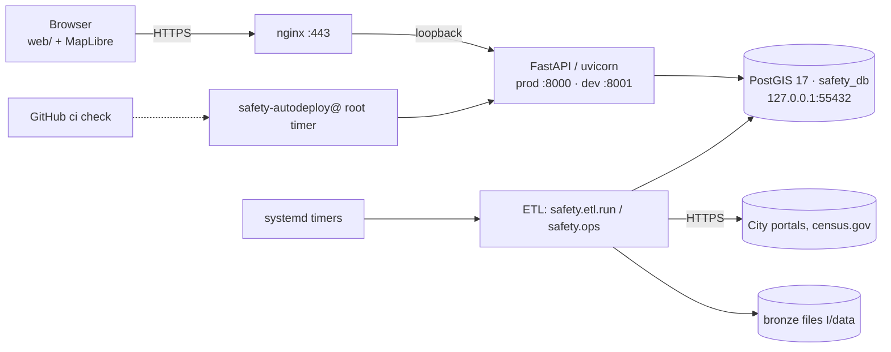
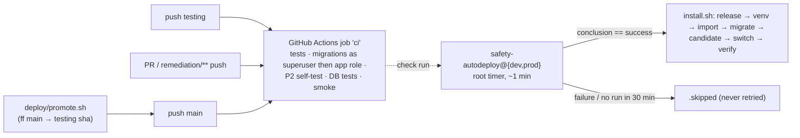

# Crime Prevention & Personal Safety Application

A public web map of **relative reported-crime activity** in roughly 500 m hexagonal cells, built from official
incident-level open data for six US cities: Philadelphia, Chicago, Seattle, Los Angeles, Washington DC and Austin.

**Live:** https://ryanfioserver.ddns.net (prod, branch `main`) · https://ryanfioserverdev.ddns.net (dev, branch `testing`)

| Document | Read it for |
|---|---|
| **this README** | Overview, configuration, local development, a summary of every other area, troubleshooting, known gaps |
| [docs/ARCHITECTURE.md](docs/ARCHITECTURE.md) | Components, tech stack, request flows, data model, networking, security model |
| [docs/DEPLOYMENT.md](docs/DEPLOYMENT.md) | Routine deploys, promotion, rollback, migrations, from-zero server setup, branch protection, deploy internals, database roles, OS users, container image. Replaces the old `docs/DEPLOY.md` |
| [docs/OPERATIONS.md](docs/OPERATIONS.md) | Schedules, logs, health checks, alerts, backups and restore, limits, runbook |
| [docs/DESIGN.md](docs/DESIGN.md) | The original system design document (target architecture, roadmap, contributors) |
| [docs/PHASE1.md](docs/PHASE1.md), [docs/PHASE2.md](docs/PHASE2.md) | What each build phase delivered, per-city data notes |

This documentation was written against commit `391c5ad` on 2026-10-08. Claims come from the source and from read-only
checks on the production host. Anything that could not be verified is marked ⚠️ and collected under
[Known gaps](#known-gaps-and-unverified-items).

---

## 1. Overview

**Who uses it.** Residents, commuters and visitors who want to know whether an area is typically quieter or busier
than others nearby, and researchers who want a documented API (see [docs/DESIGN.md §2](docs/DESIGN.md)).

**What it shows.**
- For each H3 cell, a percentile and tier of reported incidents compared with other cells in the same city, over
  windows of 3, 6 and 9 months, then 1, 2, 3 … years back to the oldest incident stored for that city
  (each city has its own list; see [ARCHITECTURE.md → Windows](docs/ARCHITECTURE.md#time-windows)).
- A severity-weighted "safety" ranking per 1,000 residents plus jobs.
- Time-of-day profiles.

It deliberately does not give an address-level "risk score".

**Architecture in one paragraph.**
- A Python ETL (`safety/etl`) pulls each city's incidents from its open-data portal on a 6-hourly systemd timer.
- It stores the raw responses on disk ("bronze"), normalizes them into one PostGIS table ("silver"), and rebuilds
  per-cell rollups ("gold").
- A FastAPI app (`safety/api`) serves those rollups read-only under `/api/v1`, together with a vanilla-JS MapLibre
  frontend (`web/`).
- Everything runs on one home server as two instances (prod and dev) behind nginx. Both share one Postgres container.
- A root systemd timer deploys each branch automatically once its GitHub Actions `ci` check passes.

## 2. Architecture



| Component | Tech | Responsibility | Port | Depends on |
|---|---|---|---|---|
| Web frontend | Vanilla JS, MapLibre GL 5.9.0, h3-js 4.2.1 (unpkg) | Map UI | served at `/` by the API | API, CDN, CARTO tiles |
| API | FastAPI 0.141.1 / uvicorn 0.52.4 | Read-only `/api/v1/*` over `gold` tables; static files | 127.0.0.1:8000 (prod), :8001 (dev) | PostgreSQL |
| ETL + ops | Python CLIs `safety.etl.run`, `safety.ops` | Portal → bronze → silver → gold | — | Portals, census.gov, PostgreSQL |
| Database | `postgis/postgis:17-3.5` (Docker) | DB `safety` (prod) and `safety_dev` (dev) | 127.0.0.1:55432 | Docker volume |
| Reverse proxy | nginx + Let's Encrypt | TLS, rate limits | 80, 443 | API |
| Deployer | bash + systemd (`deploy/`) | CI-gated deploys, candidate check, rollback | candidates on 18000 / 18001 | GitHub |

Data flow:
1. A portal returns incidents as gzipped chunks, which are saved to `I/data/bronze/…`.
2. Records are normalized and validated, then upserted into `silver.incident`.
3. `gold.*` is rebuilt and `gold.city_snapshot.last_refreshed_at` is set to now.
4. The API cache and the browsers' 60 s poll notice that timestamp and reload.

Sequence diagrams and the full component table: [docs/ARCHITECTURE.md](docs/ARCHITECTURE.md).

## 3. Tech stack

| Layer | Technology | Version | Purpose | Why it matters |
|---|---|---|---|---|
| Language | Python | 3.12 | API, ETL, migrations | The deployer hard-codes `/usr/bin/python3.12` |
| Web | FastAPI, uvicorn[standard] | 0.141.1, 0.52.4 | HTTP API, `/docs` | Single process per instance |
| DB access | psycopg[binary,pool] | 3.3.5 | Sync pool (API), COPY (ETL) | |
| Config | pydantic-settings | 2.15.0 | Env vars + `.env` | |
| Geo | h3, pyproj, pyshp | 4.5.0, 3.7.2, 3.1.6 | Cells, reprojection, census shapefiles | H3 is computed in Python, not in the DB |
| HTTP client | httpx | 0.28.1 | Portal downloads | |
| Database | PostgreSQL + PostGIS | 17 / 3.5 | All state except bronze | Shared by prod and dev |
| Frontend | MapLibre GL JS, h3-js | 5.9.0, 4.2.1 | Map rendering | MapLibre has an open advisory ([Security](#12-security)) |
| Proxy | nginx, certbot | 1.24.0, 2.9.0 | TLS, rate limiting | |
| Ops | systemd timers, Docker CE | Ubuntu 24.04, 29.8.2 | Scheduling, DB container | No Airflow, Redis or S3 |
| CI | GitHub Actions | `ubuntu-latest` | One job named `ci` | The name is the deploy gate |
| Tests | pytest, node --test | 9.1.1, Node 22 | Unit and DB tests | |

Only the 8 top-level Python packages are pinned (`requirements.txt`). Indirect dependencies are not pinned and there
is no lockfile. The pieces only interact through the database: the ETL never calls the API, and the API never runs
aggregations on the request path.

## 4. Repository layout

```
safety/                     Python package
  config.py                 every setting (pydantic); REPO_ROOT-relative paths
  db.py                     connections, wait_for_db, silver partition management
  h3grid.py                 lat/lng → H3 cell (res 8/9/10)
  migrate.py                `python -m safety.migrate`: SQL migrations + CSV reference loads
  ops.py                    `python -m safety.ops`: load whatever each enabled city is missing
  api/main.py               FastAPI app, all /api/v1 routes, response cache, static mount
  api/repository.py         every SQL query the API runs
  api/ratelimit.py          in-process token-bucket limiter
  api/security.py           CSP / HSTS / security-header middleware
  etl/run.py                `python -m safety.etl.run`: backfill, incremental, reprocess, census, release-geometry,
                            gold, safety, hourly, safety-compare, enable, weights, status, log
  etl/adapters/             one adapter per city (Carto, Socrata, Esri ArcGIS)
  etl/bronze.py · transform.py · validate.py · gold.py · census.py · boundary.py · withdrawn.py
db/migrations/              001–019 forward-only SQL migrations
reference/crosswalk/        per-city offense code → NIBRS/UCR/category CSVs (loaded on every migrate)
reference/severity/         severity schemes and weights
web/                        index.html, app.js, html.js (escape-by-default templating), styles.css
tests/                      pytest (unit + `db`-marked) and tests/js (node --test)
scripts/                    crosswalk builders; storage.py (one-off for migration 012)
deploy/
  autodeploy.sh             root CI-gated deployer (installed to /usr/local/sbin/safety-autodeploy)
  deploy.sh · promote.sh    manual redeploy; fast-forward main to testing
  lib/                      install.sh, release.sh, smoke.sh, backup.sh, notify.sh (installed to /usr/local/lib/safety-deploy)
  install-deployer.sh       installs the above, unit templates (--units) and nginx sites (--nginx)
  migrate-layout.sh         builds an instance's first release / `current`
  db-isolate.sh · os-isolate.sh · db/transfer-ownership.sql   per-instance DB roles and OS user
  systemd/                  api, etl, etl-hourly, ops, autodeploy, backup, notify units and timers;
                            *@dev.timer.d/ (dev's schedule offsets); instance-user/dev.conf (installed by os-isolate.sh)
  nginx/                    safety.conf (prod), safety-dev.conf (dev): byte-identical to the live sites
  git-hooks/ · setup-worktrees.sh   local guards: no commits on main, main only fast-forwards to testing
  logs.sh                   ETL/ops history + journal for one instance
docker-compose.yml          the PostGIS container (the only service)
Dockerfile · docker-entrypoint.sh   container image (alternative target; unused by the server, not built in CI)
.github/workflows/ci.yml    the `ci` job
.env.example                configuration template
docs/                       this documentation set
```

## 5. Prerequisites

| For | You need |
|---|---|
| Local development | Python **3.12** (CI, Docker and the server all use 3.12; a Dockerfile comment mentioning 3.14 is not a requirement), Docker with Compose v2, Node 22 for JS tests, internet access (no offline sample data). Optional: `shellcheck` |
| The server | Ubuntu 24.04, `/usr/bin/python3.12` + `python3.12-venv`, Docker CE + compose plugin, nginx, certbot (nginx plugin), git, curl, jq, openssl. Hardware today: 4 CPUs, 7.6 GiB RAM, 116 GB disk. Full list: [DEPLOYMENT.md §0](docs/DEPLOYMENT.md#0-prerequisites) |
| Access | GitHub push access to `ryanfio15/Crime-Prevention-and-Personal-Safety-Application`. For the server: a sudo login, the No-IP/ddns.net account, router admin, and an email for Let's Encrypt |

## 6. Configuration

All application settings live in `safety/config.py`. They are read once at process start, with real environment
variables taking precedence over `REPO_ROOT/.env`, which takes precedence over the code default. Names are
case-insensitive and unknown keys are ignored. On the server, each release's `.env` is a symlink to the instance's
`I/.env` (owned by the instance user, mode 0600). The API also loads that file through systemd's `EnvironmentFile=`.

Use plain `KEY=value` lines: no quotes, no `export`, comments on their own lines. `db-isolate.sh` matches whole lines,
and systemd and python-dotenv parse anything fancier differently.

| Variable | Default | Required | Read by | Purpose |
|---|---|---|---|---|
| `POSTGRES_PASSWORD` | *(none)* | **yes** | `config.py` DSN; `docker-compose.yml` | DB password. Use `openssl rand -hex 32`; it is not URL-escaped, so avoid `@:/?#` |
| `POSTGRES_DB` | `safety` | dev: **yes** (`safety_dev`) | DSN | Database name. The default is prod's database |
| `POSTGRES_USER` | `safety` | — | DSN | `safety` before isolation; `safety_prod` / `safety_dev` after `db-isolate.sh` |
| `POSTGRES_HOST` | `127.0.0.1` | — | DSN | Keep the IPv4 literal. `localhost` resolves to `::1` first and the pool times out |
| `POSTGRES_PORT` | `55432` | — | DSN; compose host port | |
| `API_PORT` | *(none)* | **server: yes** | `deploy/systemd/safety-api@.service` | 8000 prod, 8001 dev. Must match `deploy/lib/install.sh:53-54` and the nginx upstreams |
| `COMPOSE_PROJECT_NAME` | directory name | **prod server: yes** | docker compose | Must be `crime-prevention-and-personal-safety-application`, or compose creates an empty volume. Never set it in dev. **Missing from `.env.example`** |
| `BRONZE_ROOT` | `REPO_ROOT/data/bronze` | — | `safety/etl/bronze.py` | Raw pull storage. Leave it unset on the server; `.env.example`'s `./data/bronze` depends on the working directory |
| `BACKFILL_MONTHS` | `24` | — | `etl/run.py` | Backfill window |
| `ENABLE_DOCS` | `true` | — | `api/main.py:86-88` | Serves `/docs`, `/redoc` and `/openapi.json`. On in prod today |
| `ENABLE_RATE_LIMIT` | `true` | — | `api/main.py:95` | In-app limiter. Set `false` only locally or for load tests |
| `CACHE_MAX_ENTRIES` | `192` | — | `api/main.py` | Response cache entry cap |
| `CACHE_MAX_BYTES` | `268435456` | — | `api/main.py` | Response cache byte budget (256 MiB) |
| `API_STATEMENT_TIMEOUT_MS` | `15000` | — | `api/main.py:58` | Per-query limit on API connections |
| `API_POOL_TIMEOUT_SECONDS` | `10` | — | `api/main.py:62` | Wait for a pool slot before returning 503 |
| `HSTS_MAX_AGE_SECONDS` | `86400` | — | `api/security.py` | HSTS on HTTPS responses |
| `HTTP_TIMEOUT_SECONDS` | `120` | — | adapters, census | Portal request timeout |
| `HTTP_MAX_RETRIES` | `4` | — | adapters, census | Portal retries |
| `CONNECT_TIMEOUT_SECONDS` | `10` | — | DSN | libpq `connect_timeout` |
| `MIGRATE_LOCK_WAIT_SECONDS` | `600` | — | `migrate.py` | Wait for a concurrent migrate |
| `SOCRATA_APP_TOKEN` | *(empty)* | — | `etl/adapters/socrata.py` | Optional `X-App-Token` for chi, sea and lax; raises the quota. Not used by Austin, despite the comment in `config.py` |
| `OPS_CITY` · `OPS_FORCE` · `OPS_DRY_RUN` | empty · false · false | — | `safety/ops.py` | Steer `safety.ops`; CLI flags win |
| `OPS_RETRY_COOLDOWN_HOURS` | `6` | — | `safety/ops.py` | How long a failed ops step is left alone |
| `OPS_HISTORY_MINUTES` | `25` | — | `safety/ops.py` | How long one ops run spends on the history load before it stops starting slices |
| `SAFETY_MAX_WINDOW_YEARS` | *(unset)* | — | `etl/gold.py` | Fallback for disk: windows longer than this many years get counts but no safety ranking |
| `GOLD_LEGACY_WINDOWS` | `true` | — | `etl/gold.py` | Also write `last_90d`/`last_12m`/`last_24m` for the previous release; turned off with the contract migration |
| `WITHDRAWN_RECONCILE` | `report` | — | `etl/run.py` | `off` / `report` / `delete` for rows that vanish upstream. Prod stays `report` |
| `WITHDRAWN_RETENTION_DAYS` | `90` | — | `etl/run.py` | Archive retention for deleted rows |

Other variables:
- `SAFETY_TEST_DB=1` enables DB tests (CI only).
- `PORT` and `FORWARDED_ALLOW_IPS` apply to the Docker image only. Its default of `*` lets clients spoof their IP.
- `SMOKE_TIMEOUT` (60), `SAFETY_BACKUP_DIR` (`/var/backups/safety`) and `SAFETY_BACKUP_MIN_FREE_GB` (15) are read by the
  deploy scripts.

**Secrets.**
- The only application secret is the DB password, which lives in each `I/.env`.
- `db-isolate.sh` generates instance role passwords (`openssl rand -hex 32`, passed on stdin, never printed). It keeps
  a root-only copy of the pre-isolation `.env` in `/var/lib/safety-deploy/env-backup/`.
- CI uses throwaway literal passwords and no GitHub secrets.
- The deployer uses **no** GitHub token: it fetches anonymously, so the repo must stay public.
- TLS keys are managed by certbot under `/etc/letsencrypt`.
- None of these secrets are backed up off the host.

## 7. Local development

Do this on your own machine, **never on the production server**: the compose container name `safety_db`, port
55432 and the volume would collide with the live database.

```bash
git clone git@github.com:ryanfio15/Crime-Prevention-and-Personal-Safety-Application.git
cd Crime-Prevention-and-Personal-Safety-Application

python3.12 -m venv .venv
.venv/bin/pip install -r requirements-dev.txt          # requirements.txt + pytest

cp .env.example .env
sed -i "s/^POSTGRES_PASSWORD=.*/POSTGRES_PASSWORD=$(openssl rand -hex 32)/" .env
echo "ENABLE_RATE_LIMIT=false" >> .env                 # optional, local only

docker compose up -d                                   # PostGIS on 127.0.0.1:55432
docker compose ps                                      # wait for "healthy"

.venv/bin/python -m safety.migrate                     # → "Applied 17 migration(s): …"
.venv/bin/python -m safety.ops                         # phl only: backfill → census → gold → hourly (~minutes)
#   quicker smoke: .venv/bin/python -m safety.etl.run backfill --city phl --months 1 --skip-hourly

.venv/bin/python -m uvicorn safety.api.main:app --reload --port 8000
# open http://127.0.0.1:8000/   ·   API docs at http://127.0.0.1:8000/docs
```

- **The API will not start without a reachable DB.** It waits up to 30 s for its pool. Against an unmigrated DB it
  starts, but every data route returns 500.
- Only **Philadelphia** is enabled on a fresh database. For other cities, run
  `.venv/bin/python -m safety.etl.run enable --city chi`, then `.venv/bin/python -m safety.ops --city chi`. The
  per-city steps in `docs/PHASE2.md` leave out `enable`. Leave Austin disabled (see
  [Known gaps](#known-gaps-and-unverified-items)).
- There is no sample dataset: the first load is a live pull from the portal.
- Hot reload: `--reload` restarts on Python changes, and `web/` is served from disk with no build step.
- A smaller load with `--months` is never widened later by `incremental` or `ops`. Run `backfill` again without
  `--months` to get the full 24 months.
- Older years come from the separate history load (`safety.etl.run history --city <id> --force`), described in
  [OPERATIONS.md → Loading a city's full history](docs/OPERATIONS.md#loading-a-citys-full-history).
- `docs/PHASE1.md` uses Windows paths (`.venv/Scripts/python.exe`); use `.venv/bin/python` on macOS and Linux.

### Tests and lint

These are the checks CI runs that need no database. All of them pass on this commit: 116 Python tests (21 deselected)
and 6 JS tests.

```bash
.venv/bin/python -m compileall -q safety
.venv/bin/python -c "import safety.api.main, safety.migrate, safety.etl.run"
.venv/bin/python -m pytest -q -m "not db"
node --check web/app.js && node --check web/html.js     # one file per call: `node --check a b` checks only a
node --test tests/js/*.test.mjs                          # the glob is needed on Node 22
for f in deploy/*.sh deploy/lib/*.sh deploy/git-hooks/*; do bash -n "$f"; done
shellcheck deploy/*.sh deploy/lib/*.sh deploy/git-hooks/*
```

**DB tests are destructive.** `tests/test_gold_invariants.py` deletes every phl incident and the phl boundary, commits
synthetic data, and never restores anything. Run them only against a throwaway database, for example a second compose
project with a different `container_name` and port:
```bash
POSTGRES_PORT=<test port> POSTGRES_PASSWORD=<pw> .venv/bin/python -m safety.migrate
POSTGRES_PORT=<test port> POSTGRES_PASSWORD=<pw> SAFETY_TEST_DB=1 .venv/bin/python -m pytest -q -m db
```
Without `SAFETY_TEST_DB=1`, `db`-marked tests are skipped. CI runs them as a non-superuser role, so a migration that
needs superuser rights passes locally but fails CI.

There is no Python or JS linter or formatter configured. Only shell is linted, with shellcheck.

## 8. Deployment

Full guide: **[docs/DEPLOYMENT.md](docs/DEPLOYMENT.md)**. In short:

1. Commit and push `testing`.
2. CI (`ci`) passes.
3. Within about a minute, `safety-autodeploy@dev` builds a release, migrates, tests a candidate on :18001, switches
   `current`, smoke-tests :8001, and starts `safety-ops@dev`.
4. Check it: `curl -s https://ryanfioserverdev.ddns.net/api/v1/health | jq .commit`.
5. Run `deploy/promote.sh` to fast-forward `main` to the head of `origin/testing`, once CI has passed on it. Prod then
   deploys the same way. Check first that dev's `/api/v1/health` commit matches `origin/testing`.

- **Rollback**: a failed live check rolls back automatically. Otherwise `git revert` and push. For an emergency
  `current` swap, see [DEPLOYMENT.md → Rollback](docs/DEPLOYMENT.md#rollback). Migrations are never undone.
- **Single instance**: `deploy/deploy.sh prod|dev`. This does not check CI.
- **Migrations** run on every deploy as the instance's non-superuser role, are forward-only, and must keep the previous
  release working.
- **Not zero-downtime**: expect a few seconds of 502 during the restart.
- **First-time server setup** has 11 steps and is not scripted as a whole:
  [DEPLOYMENT.md → From-zero setup](docs/DEPLOYMENT.md#from-zero-setup).

## 9. Networking

| Bind | What | Exposure |
|---|---|---|
| `:80`, `:443` (IPv4 + IPv6) | nginx | Public via router port-forward; 80 only redirects (and serves certbot renewal) |
| `127.0.0.1:8000` / `:8001` | prod / dev API | Loopback |
| `127.0.0.1:18000` / `:18001` | candidate during a deploy | Loopback, ≤ 300 s |
| `127.0.0.1:55432` → 5432 | PostGIS | Loopback (Docker bypasses UFW, so never publish on 0.0.0.0) |

- **TLS**: Let's Encrypt, `certbot --nginx`, renewed by `certbot.timer`.
- **DNS**: `ryanfioserver.ddns.net` / `ryanfioserverdev.ddns.net`, DDNS updater unknown (⚠️).
- **Proxy trust**: uvicorn trusts `X-Forwarded-For` from `127.0.0.1` only.
- **CORS**: none (same origin).
- **Security headers**: set by the app.
- **Outbound**: phl.carto.com, three Socrata portals, DC and Austin ArcGIS, census.gov, GitHub, PyPI, Let's Encrypt;
  the browser loads unpkg and CARTO.

Diagram, all 14 routes and the dependency table: [ARCHITECTURE.md → Networking](docs/ARCHITECTURE.md#networking).

## 10. Data & persistence

- **Stores**:
  - PostGIS: `reference`, `etl`, `silver` and `gold` schemas, with the two databases `safety` and `safety_dev` in one
    cluster.
  - Bronze raw files: `I/data/bronze`, never pruned.
  - An in-process API cache.
- **Migrations**: `python -m safety.migrate`, 18 checksummed forward-only files under an advisory lock. Every run also
  reloads the crosswalk and severity CSVs.
- **Backups**: a nightly `pg_dump` of both databases to `/var/backups/safety` (7 days prod, 2 days dev), plus a monthly
  test restore of prod, which has not yet run. **Same disk, unencrypted, no off-host copy.** Bronze and `.env` files are
  not backed up.
- **Loss**: losing the Docker volume loses both prod and dev. Losing the disk loses everything, including the backups.

Restore commands: [OPERATIONS.md → Backups](docs/OPERATIONS.md#backups). Schema and loss table:
[ARCHITECTURE.md → Data model](docs/ARCHITECTURE.md#data-model-and-persistence).

## 11. CI/CD



**Triggers.** CI runs on pushes to `main`, `testing` and `remediation/**`, and on every pull request. It runs on
`ubuntu-latest` with a `postgis/postgis:17-3.5` service. It uses no secrets and uploads no artifacts.

**Steps.**
1. Install, compile and import the entry points; `pytest -m "not db"`; JS tests; `bash -n` and shellcheck on `deploy/`.
2. Apply `main`'s migrations as the superuser, which reproduces the server's history.
3. Run `transfer-ownership.sql` twice to prove it is idempotent.
4. Apply this branch's migrations as the non-superuser `safety_app`, then run migrate again.
5. P2 self-test: a `CREATE ROLE` migration must fail.
6. DB tests; the ETL log query; uvicorn plus `deploy/lib/smoke.sh`.
7. Advisory step: the previous commit must still serve on the new schema.

**Mapping.** `testing` deploys dev and `main` deploys prod. Other branches and PRs never deploy. The deployer reads
GitHub's check run named exactly `ci` from app `github-actions`, anonymously, at most once per 120 s per instance.
Renaming the job, or adding a matrix, stops all deploys. Details: [DEPLOYMENT.md](docs/DEPLOYMENT.md#routine-deploys).

## 12. Security

- **Authentication**: none, by design. The API is read-only (GET) over aggregated public data. There are no accounts,
  cookies or writes.
- **Controls**:
  - two layers of per-IP rate limiting (nginx and the app);
  - pool and statement timeouts that return 503;
  - parameterized SQL throughout the API;
  - escape-by-default HTML in the frontend;
  - SRI-pinned CDN scripts;
  - CSP, `nosniff`, `X-Frame-Options: DENY` and HSTS.
- **Trust boundaries**: internet → nginx → uvicorn on loopback (prod as user `safety`, dev as `safety-dev`) →
  Postgres on loopback, where each instance has its own non-superuser owner role. The root deployer runs repo code
  only as the instance user.

Known concerns, recorded and not fixed:
- **High**: `main` and `testing` have no branch protection in a public repo.
- **Medium**:
  - The prod instance directory is owned by the app user.
  - Root writes into the extracted tree during a release build, so a committed symlink becomes a root file write.
  - The API connects as the DB owner role.
  - MapLibre 5.9.0 has a critical XSS advisory (GHSA-jrc7-96c5-q579).
  - `deploy.sh` skips the CI check.
- **Low**: minimal systemd sandboxing, unpinned indirect dependencies, and a public `/docs`.

Full table: [ARCHITECTURE.md → Security model](docs/ARCHITECTURE.md#security-model).

## 13. Observability & operations

- **Logs**: in the systemd journal. Use `journalctl -u safety-api@prod`, `deploy/logs.sh prod` for ETL history, and
  `journalctl -u safety-autodeploy@prod` for deploys. nginx writes per-site logs.
- **Health**: `/api/v1/health` proves the DB is reachable and reports the commit. It does not check data freshness.
- **Metrics and tracing**: none.
- **Alerts**: `OnFailure=` writes to the journal (`journalctl -t safety-notify -p err`) and to
  `/var/lib/safety-notify/alerts.log` **only**. Nobody is paged.
- **Scaling**: one uvicorn process per instance, a pool of 8, a 256 MiB cache, and no memory or CPU limits.

Runbook, schedules and the "site is down" checklist: [docs/OPERATIONS.md](docs/OPERATIONS.md).

## 14. Troubleshooting

| Symptom | Cause | Fix |
|---|---|---|
| `docker compose up` fails: `required variable POSTGRES_PASSWORD is missing a value` | No password in `.env` (there is no default) | Set `POSTGRES_PASSWORD` in `.env` (locally) or prod's `I/.env` |
| API startup or requests fail with `PoolTimeout: pool initialization incomplete` | DB down, wrong `POSTGRES_*`, or `POSTGRES_HOST=localhost` (tries `::1`; the DB listens on IPv4 only) | Use `127.0.0.1`; `sudo docker ps --filter name=safety_db`; check `I/.env`; `sudo systemctl restart safety-api@<i>` |
| `RuntimeError: POSTGRES_PASSWORD is not set` | Same, raised lazily at first connection | Set it |
| `bind: address already in use` on 55432 / 8000 | A second compose stack or uvicorn on the same host, e.g. running a clone on the prod server | Never run the local stack on the server; locally, change `POSTGRES_PORT` or `--port` |
| Fresh `safety-api@` won't start: uvicorn complains about the port | `API_PORT` missing from `I/.env`, so the unit expands `--port` with an empty value | Add `API_PORT=8000` (prod) / `8001` (dev) |
| Compose run on the server shows an empty database | Ran from the wrong directory, or without `COMPOSE_PROJECT_NAME`, which created a new volume | Run only from `prod/current` with `COMPOSE_PROJECT_NAME=crime-prevention-and-personal-safety-application` |
| `/api/v1/health` returns 500, "relation … does not exist" | Schema not migrated (e.g. `migrate-layout.sh cleanup` run before the first deploy) | `deploy/deploy.sh <i>` (runs migrate) |
| `backfill --city chi`: "source 'chi' is disabled" | Only phl is enabled by migrations | `python -m safety.etl.run enable --city chi` |
| Migrate: `MigrationChecksumError` | An already-applied migration file was edited | Revert the edit and add a new migration instead |
| Deploy never happens; journal shows nothing new | Head is in `<i>.skipped`: CI failed, no CI within 30 min, install failed, or a lock timeout during the 02:15 backup | `journalctl -u safety-autodeploy@<i> -p err`; push a fix. If CI itself was the problem, re-run it until it passes, then `sudo rm /var/lib/safety-deploy/<i>.skipped` |
| Journal: `pending … CI is in_progress` or `HTTP 403` | CI still running, or the anonymous GitHub API quota (60/h per IP) is exhausted | Wait; the deployer honours `x-ratelimit-reset` |
| Journal: `deferred … ETL running` | An ETL, hourly or ops run holds the instance's lock (exit 75) | Wait, or `sudo systemctl stop safety-ops@<i>` and redeploy |
| Journal: `rejected <sha> at the candidate check` | The new release failed smoke on 18000/18001; live is untouched | Read the 20 journal lines printed above it; fix and push |
| Migration fails in CI with `permission denied to …` | The migration needs superuser rights (e.g. `CREATE EXTENSION`) | Apply it by hand as `safety` (see [DEPLOYMENT.md](docs/DEPLOYMENT.md#migrations-during-a-deploy)) |
| `429 Too Many Requests` | Rate limit (cells 2 r/s, others 10 r/s per IP) | Expected; locally set `ENABLE_RATE_LIMIT=false` |
| 503 with `Retry-After: 5` | Pool saturated or a query over 15 s | Check for a long migration or ETL; consider `API_STATEMENT_TIMEOUT_MS` |
| Browser console: CSP blocked a script or style | A new third-party origin not in `safety/api/security.py` | Add it to `APP_CSP` deliberately |
| Map loads but no basemap | CARTO or unpkg unreachable from the browser | Network or CDN issue; the CSP allows only those hosts |
| Site down, TLS error in the browser | Certificate expired (nothing alerts on this) or DDNS points at an old IP | `sudo certbot certificates`; `sudo certbot renew`; check the DDNS record |
| `install-deployer.sh --nginx` refuses with a diff | The live nginx site was edited (e.g. by certbot) and not committed | Commit the live file to the repo first, then re-run |
| `node --test tests/js/` fails with `Cannot find module` | Node 22 does not accept a directory | `node --test tests/js/*.test.mjs` |
| Docker image starts but rate limits misbehave | `FORWARDED_ALLOW_IPS=*` (default) trusts client-supplied XFF | Set it to the proxy's IP/CIDR |

## Known gaps and unverified items

### Open items

1. **Austin licensing (deferred).** Prod and dev serve `aus` with `enabled: true`, but
   `db/migrations/016_onboard_austin.sql:10-13` and `docs/PHASE2.md:22` say Austin must stay disabled until the City
   confirms its CrimeViewer services may be reused. Note that `enable --city aus --off` only stops loading; the API
   lists every city that has a `gold.city_snapshot` row, enabled or not (`safety/api/repository.py:200-226`).
2. **Branch protection** on `main` and `testing`: to be turned on as described in
   [DEPLOYMENT.md → Branch protection](docs/DEPLOYMENT.md#branch-protection-and-github-settings).
3. **Off-host backups.** The plan is to keep the off-host copy on GitHub; not set up yet. Database dumps must never go
   into this public repository, and the two `.env` files (database passwords) belong in a password manager, not on
   GitHub.
4. **Alerting.** Alerts reach only the host's journal: no webhook or email in `notify.sh`, no external uptime check,
   no cert-expiry alert.
5. **Prod directory ownership** (`safety:safety 0700`): whether to harden it to `root:safety 0750` like dev.
6. **Python version.** Confirm 3.12 and fix the "3.14 for local development" comment in `Dockerfile:10`.
7. **Docker image.** Keep it and build it in CI, or remove it.
8. **Firewall.** The UFW rules for this host were not checked, because reading them needs root.

### What GitHub alone cannot restore

The repository holds the code, schema migrations, systemd units, nginx sites and install scripts, so the server can be
rebuilt from it with [DEPLOYMENT.md → From-zero setup](docs/DEPLOYMENT.md#from-zero-setup). These live only on the
host and must be recreated or restored from elsewhere:

- the two `.env` files and their secrets (template: `.env.example`);
- which cities are enabled (database state; set again with `safety.etl.run enable`);
- the data: bronze files and both databases. They reload from the cities' public sources with `safety.ops`, which
  takes hours, and records a city has since withdrawn do not come back. A database dump avoids both;
- TLS certificates (reissued by certbot), the router's port forwarding and the DDNS updater.

The from-zero procedure has never been run end to end.

### Known doc and config drift (not fixed here)

- `.env.example` lacks `COMPOSE_PROJECT_NAME` and 7 tunables listed in [Configuration](#6-configuration).
- The `safety-backup.timer` comment says a lock-timeout deploy "is retried" (it is skipped).
- `docs/PHASE2.md`'s per-city steps omit `enable`. `docs/PHASE1.md` uses Windows paths and `requirements.txt` (no
  pytest).
- Stale comments:
  - Railway and "hosted ops service" wording in `.env.example`, `config.py` and `run.py`.
  - `SOCRATA_APP_TOKEN` "used by Austin".
  - `deploy/nginx/safety.conf` cites `docs/LINUX-MIGRATION.md`, which does not exist, and old `web/app.js` line
    numbers.
  - `tests/js/html.test.mjs:2` suggests a command that fails on Node 22.
- `safety-etl@` and `safety-etl-hourly@` timers lack `UTC` in `OnCalendar`, so they depend on the host clock being UTC.
- Dead code: `ops.plan_for_city`, `bronze.BronzePull`. `/api/v1/cells/lookup` is unused by the frontend.
- No LICENSE file in a public repository.

### Top risks

| # | Risk | Why |
|---|---|---|
| 1 | Backups on the same disk as the database, no off-host copy yet, restore never yet verified | One disk failure loses prod, dev, every dump, bronze history and the `.env` files |
| 2 | Branch protection not yet on, in a public repo whose pushes auto-deploy | Until the ruleset is on, a force push or an unchecked commit on `main` goes straight to prod |
| 3 | Austin data served against the repo's own licensing gate (deferred) | Legal exposure; it reads undocumented endpoints that may change |
| 4 | One host, one shared Postgres for prod and dev, home ISP, router and DDNS | Any of them failing is a full outage. A dev bug that fills the disk takes prod down. Alerts reach nobody off the box |
| 5 | Host-only state (see [above](#what-github-alone-cannot-restore)) and an untested from-zero procedure | A rebuild works only if the `.env` secrets are kept somewhere safe, and may hit gaps in the procedure the first time |

### Unverified (could not be checked read-only without root)

- UFW rules.
- The live `.env` values.
- The `/var/lib/safety-deploy` state.
- Bronze size.
- Whether the superuser password was rotated.
- The certbot renewal reload.
- That the Docker image builds.
- That the from-zero sequence in DEPLOYMENT.md works end to end.
- GitHub's ordering of `check_runs` when one commit has several `ci` runs.
- Whether MapLibre's vulnerable sanitizer is reachable.
